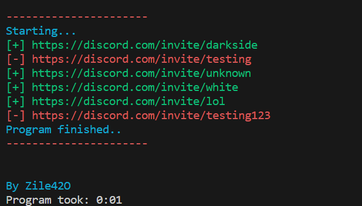

# discord-invite-validator

### Usage

Simple golang program, invite links goes to `check.txt`, after that program will scan all links and output it in two files `valid.txt` or `invalid.txt` depends on status.

### Build
```
go build
```
### Run
```
go run main
```
Or (if you did build)
```
./main.exe 
```

### Demo [output]

